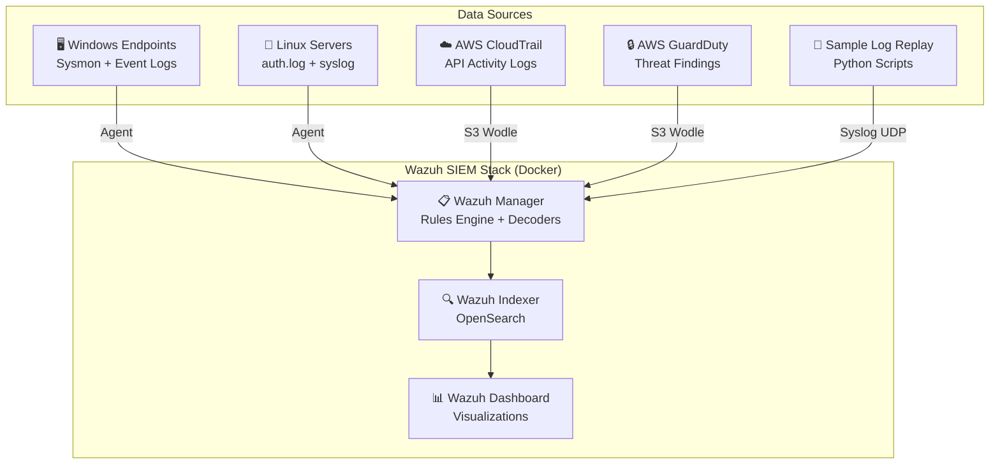

# 🛡️ Home SOC Lab — SIEM + Cloud Security Monitoring


> A production-ready, portfolio-grade Security Operations Center (SOC) lab featuring Wazuh SIEM with 20 custom detection rules mapped to MITRE ATT&CK, multi-source log ingestion (Windows, Linux, AWS CloudTrail, GuardDuty), automated attack simulation, and pre-built dashboards — all running locally via Docker Compose.

---

## 📋 Overview

This project demonstrates end-to-end SOC analyst capabilities by deploying a fully functional SIEM environment with custom detection engineering, cloud security monitoring, and incident response workflows. It ingests logs from Windows endpoints, Linux servers, and AWS cloud services, applying custom correlation rules to generate actionable security alerts.

**Why this matters:** Security Operations Center analysts need hands-on experience with real tooling. This lab provides a safe, reproducible environment that mirrors enterprise SOC infrastructure — without requiring cloud spend or production access. Every detection rule, dashboard, and runbook in this project maps directly to skills listed in SOC analyst job postings.

---

## 🎯 Skills Demonstrated

- **SIEM Deployment & Administration** — Deployed and configured Wazuh 4.9 (Manager, Indexer, Dashboard) using Docker Compose with custom volumes, certificates, and networking
- **Log Ingestion (Multi-Source)** — Configured ingestion pipelines for Windows Event Logs (Sysmon), Linux auth/syslog, AWS CloudTrail, and AWS GuardDuty
- **Detection Engineering** — Authored 20 custom detection rules with decoders, CDB lists, and frequency-based correlation across 4 threat categories
- **Cloud Security Monitoring (AWS)** — Built detections for IAM misconfigurations, S3 exposure, credential abuse, and crypto-mining using CloudTrail and GuardDuty logs
- **MITRE ATT&CK Framework Mapping** — Every rule mapped to specific ATT&CK techniques and tactics for standardized threat classification
- **Incident Response** — Created structured runbooks, incident report templates, and escalation procedures for 5 common attack scenarios
- **Dashboard & Visualization Creation** — Built 4 operational dashboards (SOC Overview, Cloud Security, Threat Hunting, MITRE Coverage) in Wazuh/OpenSearch

---

## 🏗️ Architecture



**Data flows from left to right:** Log sources (endpoints, cloud services, replay scripts) feed into the Wazuh Manager, which decodes, normalizes, and applies detection rules. Alerts are indexed in OpenSearch and visualized through the Wazuh Dashboard.

> 📖 For detailed architecture documentation, see [docs/ARCHITECTURE.md](docs/ARCHITECTURE.md).

---

## 🚀 Quick Start

```bash
# 1. Clone the repository
git clone https://github.com/YOUR_USERNAME/home-soc-lab.git
cd home-soc-lab

# 2. Run the automated setup
chmod +x scripts/setup_lab.sh
./scripts/setup_lab.sh

# 3. Access the Wazuh Dashboard
# Open https://localhost:443 in your browser
# Default credentials: admin / SecretPassword (change in .env)
```

The setup script will:
1. Validate Docker and Docker Compose are installed
2. Generate TLS certificates for inter-component communication
3. Start all containers (Manager, Indexer, Dashboard)
4. Load custom rules, decoders, and CDB lists
5. Import pre-built dashboards
6. Run a health check to confirm all services are operational

---

## 🔍 Detection Rules

This lab includes **20 custom detection rules** across 4 threat categories, all mapped to the MITRE ATT&CK framework.

### Windows Attack Detection

| Rule ID | Description | MITRE Technique | Severity |
|---------|-------------|-----------------|----------|
| 100001 | Mimikatz credential dumping detected | T1003 — OS Credential Dumping | **Critical** |
| 100002 | Encoded PowerShell command execution | T1059.001 — PowerShell | **High** |
| 100003 | New service created via command line | T1543.003 — Windows Service | **Medium** |
| 100004 | LSASS memory access detected | T1003.001 — LSASS Memory | **Critical** |
| 100005 | Suspicious parent-child process relationship | T1055 — Process Injection | **High** |

### Linux Persistence Detection

| Rule ID | Description | MITRE Technique | Severity |
|---------|-------------|-----------------|----------|
| 100101 | Crontab modification detected | T1053.003 — Cron | **High** |
| 100102 | SSH authorized_keys modification | T1098.004 — SSH Authorized Keys | **High** |
| 100103 | SUID binary creation detected | T1548.001 — Setuid/Setgid | **Critical** |
| 100104 | Execution from /tmp directory | T1036.005 — Match Legitimate Name | **Medium** |

### Cloud Threat Detection (AWS)

| Rule ID | Description | MITRE Technique | Severity |
|---------|-------------|-----------------|----------|
| 100201 | AWS console login without MFA | T1078 — Valid Accounts | **High** |
| 100202 | S3 bucket made public | T1530 — Data from Cloud Storage | **Critical** |
| 100203 | New IAM user created | T1136.003 — Cloud Account | **Medium** |
| 100204 | Root account usage detected | T1078.004 — Cloud Accounts | **Critical** |
| 100205 | Crypto mining activity detected | T1496 — Resource Hijacking | **Critical** |
| 100206 | Command & control communication | T1071 — Application Layer Protocol | **Critical** |
| 100207 | CloudTrail logging disabled | T1562.008 — Disable Cloud Logs | **Critical** |
| 100208 | Excessive AccessDenied errors | T1580 — Cloud Infrastructure Discovery | **Medium** |

### Brute Force Detection

| Rule ID | Description | MITRE Technique | Severity |
|---------|-------------|-----------------|----------|
| 100301 | SSH brute-force attack detected | T1110.001 — Password Guessing | **High** |
| 100302 | RDP brute-force attack detected | T1110.001 — Password Guessing | **High** |
| 100303 | Successful login after brute-force | T1078 — Valid Accounts | **Critical** |

> 📖 For complete detection documentation with log sources, tuning guidance, and false positive notes, see [docs/DETECTION_CATALOG.md](docs/DETECTION_CATALOG.md).

---

## ☁️ Cloud Integration

### Sample Logs (No AWS Account Required)

This lab ships with **realistic sample logs** for both AWS CloudTrail and GuardDuty, so you can explore cloud security detections without any AWS spend:

```bash
# Replay CloudTrail logs through the SIEM
python3 scripts/generate_cloudtrail.py

# Replay GuardDuty findings
python3 scripts/generate_guardduty.py
```

Sample logs include scenarios like console logins without MFA, S3 bucket policy changes, IAM user creation, root account usage, and GuardDuty findings for crypto mining and C2 activity.

### Connecting Real AWS (Optional)

To ingest live AWS logs, configure the Wazuh S3 wodle in `config/wazuh/ossec.conf`:

1. **Create an S3 bucket** for CloudTrail and GuardDuty log delivery
2. **Enable CloudTrail** logging to the S3 bucket
3. **Enable GuardDuty** and configure findings export to S3
4. **Create an IAM role** with `s3:GetObject` and `s3:ListBucket` permissions
5. **Update `ossec.conf`** with your bucket name, region, and credentials
6. **Restart the Wazuh Manager** to apply changes

---

## 📊 Dashboards

Four pre-built dashboards are included and automatically imported during setup:

| Dashboard | Purpose | Key Panels |
|-----------|---------|------------|
| **SOC Overview** | High-level operational view | Alert volume trends, severity distribution, top triggered rules, top source IPs |
| **Cloud Security** | AWS-specific monitoring | CloudTrail event heatmap, IAM activity, S3 configuration changes, GuardDuty findings |
| **Threat Hunting** | Proactive investigation | Process trees, network connections, DNS queries, file integrity changes |
| **MITRE ATT&CK Coverage** | Framework alignment | Technique heatmap, tactic distribution, detection gaps, rule coverage metrics |

Import manually if needed:

```bash
# Import all dashboards
for f in dashboards/*.ndjson; do
  curl -k -X POST "https://localhost:443/api/saved_objects/_import?overwrite=true" \
    -H "osd-xsrf: true" \
    -H "securitytenant: global" \
    -u admin:SecretPassword \
    --form file=@"$f"
done
```

---

## 🔄 Log Replay

The log replay system lets you feed sample logs through the SIEM to trigger detections without live endpoints:

```bash
# Replay all sample logs (Windows, Linux, CloudTrail, GuardDuty)
python3 scripts/log_replay.py --all

# Replay specific log category
python3 scripts/log_replay.py --category windows
python3 scripts/log_replay.py --category linux
python3 scripts/log_replay.py --category cloudtrail
python3 scripts/log_replay.py --category guardduty

# Replay with time delay between events (simulates real-time)
python3 scripts/log_replay.py --all --delay 2
```

Logs are sent via **syslog (UDP 514)** to the Wazuh Manager, where they are decoded, normalized, and matched against detection rules.

---

## ⚔️ Attack Simulation

The `attack_simulation.sh` script runs safe, controlled attack simulations against the lab environment:

```bash
# Run all attack simulations
chmod +x scripts/attack_simulation.sh
./scripts/attack_simulation.sh --all

# Run specific attack category
./scripts/attack_simulation.sh --brute-force
./scripts/attack_simulation.sh --persistence
./scripts/attack_simulation.sh --credential-access
```

**Simulated attack scenarios include:**
- SSH brute-force attempts from multiple source IPs
- Crontab persistence installation
- SSH authorized_keys injection
- Suspicious process execution from `/tmp`
- Encoded PowerShell command execution (via log injection)

> ⚠️ **Warning:** Only run attack simulations in isolated lab environments. Never run against production systems.

---

## 📁 Project Structure

```
home-soc-lab/
├── docker-compose.yml              # Container orchestration for Wazuh stack
├── .env                            # Environment variables (credentials, versions)
├── README.md                       # This file
│
├── config/                         # Wazuh configuration
│   ├── wazuh/
│   │   ├── ossec.conf              # Manager configuration (log sources, wodles)
│   │   ├── local_rules.xml         # Custom detection rules (loaded on start)
│   │   ├── local_decoders.xml      # Custom log decoders
│   │   └── lists/
│   │       └── malicious_ips.txt   # CDB list of known malicious IPs
│   └── sysmon/
│       └── sysmonconfig.xml        # Sysmon configuration for Windows agents
│
├── rules/                          # Detection rules (organized by category)
│   ├── windows_attacks.xml         # Rules 100001-100005
│   ├── linux_persistence.xml       # Rules 100101-100104
│   ├── cloud_threats.xml           # Rules 100201-100208
│   └── brute_force.xml             # Rules 100301-100303
│
├── scripts/                        # Automation and simulation scripts
│   ├── setup_lab.sh                # One-command lab deployment
│   ├── log_replay.py               # Multi-source log replay engine
│   ├── generate_cloudtrail.py      # Generate sample CloudTrail events
│   ├── generate_guardduty.py       # Generate sample GuardDuty findings
│   └── attack_simulation.sh        # Safe attack simulation scripts
│
├── sample-logs/                    # Realistic sample log data
│   ├── cloudtrail/                 # AWS CloudTrail JSON events
│   ├── guardduty/                  # AWS GuardDuty JSON findings
│   ├── windows/                    # Windows Event Log / Sysmon JSON
│   └── linux/                      # Linux auth.log / syslog entries
│
├── dashboards/                     # Pre-built Wazuh/OpenSearch dashboards
│   ├── soc_overview.ndjson         # SOC operational overview
│   ├── cloud_security.ndjson       # AWS cloud security monitoring
│   ├── threat_hunting.ndjson       # Proactive threat hunting
│   └── mitre_coverage.ndjson       # MITRE ATT&CK coverage map
│
└── docs/                           # Documentation
    ├── ARCHITECTURE.md             # Detailed system architecture
    ├── DETECTION_CATALOG.md        # Complete detection rule catalog
    ├── INCIDENT_REPORT_TEMPLATE.md # IR report template + example
    └── RUNBOOK.md                  # SOC operational runbooks
```

---

## 📄 License

This project is licensed under the **MIT License** — see the [LICENSE](LICENSE) file for details.

You are free to use this project for learning, portfolio demonstration, and interview preparation. Attribution is appreciated but not required.

---

<p align="center">
  Built with 🔒 for the cybersecurity community
</p>
