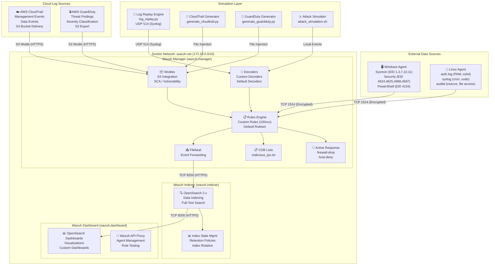
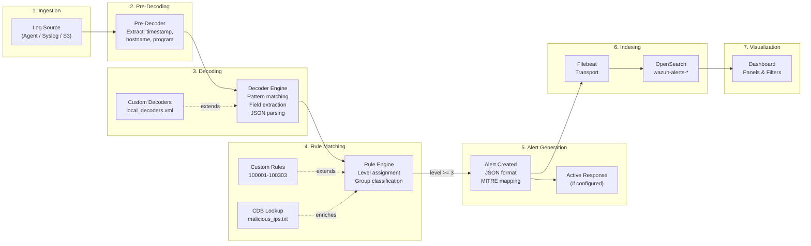
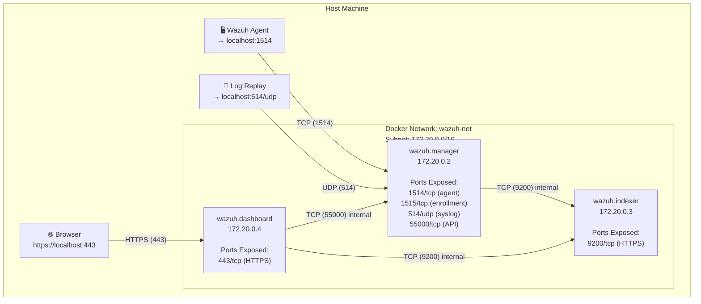

# 🏗️ Architecture — Home SOC Lab

> Detailed system architecture, data flow pipelines, and infrastructure design for the Home SOC Lab SIEM environment.

---

## Table of Contents

- [System Architecture](#system-architecture)
- [Data Flow Pipeline](#data-flow-pipeline)
- [Docker Network Topology](#docker-network-topology)
- [Component Descriptions](#component-descriptions)
- [Port Mappings](#port-mappings)
- [Volume Mappings](#volume-mappings)
- [Security Considerations](#security-considerations)

---

## System Architecture

---

## Data Flow Pipeline

The following diagram illustrates how a single log event traverses the entire pipeline from ingestion to alert visualization:

### Pipeline Stages Explained

| Stage | Component | Description |
|-------|-----------|-------------|
| **1. Ingestion** | Agent / Syslog / S3 Wodle | Raw logs enter via encrypted agent connection (TCP 1514), syslog (UDP 514), or S3 polling |
| **2. Pre-Decoding** | Pre-Decoder | Extracts common fields: timestamp, hostname, program name from the raw log header |
| **3. Decoding** | Decoder Engine | Matches log format patterns and extracts structured fields (user, source IP, action, etc.) |
| **4. Rule Matching** | Rule Engine | Evaluates decoded events against rule conditions, frequency triggers, and CDB list lookups |
| **5. Alert Generation** | Alerting System | Generates structured JSON alerts with severity levels, MITRE ATT&CK mappings, and rule metadata |
| **6. Indexing** | Filebeat → OpenSearch | Transports alerts to OpenSearch for indexing, enabling full-text search and aggregations |
| **7. Visualization** | Dashboard | Renders indexed alerts as interactive panels, charts, and tables for analyst consumption |

---

## Docker Network Topology

### Inter-Container Communication

All containers communicate over the `wazuh-net` bridge network using internal DNS resolution:

- **Manager → Indexer:** Filebeat forwards alerts over HTTPS (port 9200) using mutual TLS
- **Dashboard → Indexer:** Queries alert indices over HTTPS (port 9200) using mutual TLS
- **Dashboard → Manager:** Proxies Wazuh API requests over HTTPS (port 55000) for agent management and rule testing

---

## Component Descriptions

### Wazuh Manager (`wazuh.manager`)

The central processing engine of the SIEM stack. Receives raw log data from agents, syslog sources, and cloud integrations, then decodes, normalizes, and evaluates events against the detection rule set.

**Key responsibilities:**
- **Agent communication** — Manages agent enrollment, authentication, and encrypted data transport
- **Log decoding** — Applies pre-decoders and decoders to extract structured fields from raw log formats
- **Rule evaluation** — Matches decoded events against 20 custom rules and the default Wazuh ruleset
- **Active response** — Executes automated containment actions (e.g., IP blocking) when high-severity rules trigger
- **CDB list lookups** — Enriches events with threat intelligence from CDB lists (e.g., `malicious_ips.txt`)
- **S3 integration** — Polls AWS S3 buckets for CloudTrail and GuardDuty logs via the S3 wodle

### Wazuh Indexer (`wazuh.indexer`)

An OpenSearch 2.x instance that stores, indexes, and enables searching of all security alerts and archived events.

**Key responsibilities:**
- **Alert storage** — Indexes alerts into time-based indices (`wazuh-alerts-4.x-YYYY.MM.DD`)
- **Full-text search** — Provides Lucene-based query capabilities for alert investigation
- **Index lifecycle** — Manages index rotation, retention policies, and storage optimization via ISM
- **Cluster health** — Monitors shard allocation, disk usage, and indexing performance

### Wazuh Dashboard (`wazuh.dashboard`)

An OpenSearch Dashboards instance with the Wazuh plugin, providing the web-based UI for alert visualization, agent management, and rule configuration.

**Key responsibilities:**
- **Alert visualization** — Renders pre-built and custom dashboards with interactive panels
- **Agent management** — Displays agent status, configuration, and compliance reports
- **Rule testing** — Provides a rule testing interface via the Wazuh API proxy
- **MITRE ATT&CK mapping** — Visualizes detection coverage against the ATT&CK framework

### Filebeat (Embedded in Manager)

Filebeat runs inside the Manager container and is responsible for shipping alerts from the Manager to the Indexer.

**Key responsibilities:**
- **Alert transport** — Reads `alerts.json` and forwards events to OpenSearch over HTTPS
- **Buffering** — Provides disk-based buffering to handle indexing backpressure
- **TLS authentication** — Uses mutual TLS certificates for secure transport

---

## Port Mappings

| Port | Protocol | Service | Container | Description |
|------|----------|---------|-----------|-------------|
| **443** | TCP/HTTPS | Wazuh Dashboard | `wazuh.dashboard` | Web UI access — primary analyst interface |
| **1514** | TCP | Agent Communication | `wazuh.manager` | Encrypted agent data transport (AES-256) |
| **1515** | TCP | Agent Enrollment | `wazuh.manager` | New agent registration and key exchange |
| **514** | UDP | Syslog | `wazuh.manager` | Syslog receiver for log replay and remote syslog sources |
| **9200** | TCP/HTTPS | OpenSearch API | `wazuh.indexer` | REST API for indexing and search (internal + external) |
| **55000** | TCP/HTTPS | Wazuh API | `wazuh.manager` | RESTful API for agent and rule management |

> **Note:** Only ports 443 (Dashboard) and 514/UDP (Syslog) need to be exposed for basic lab usage. Other ports are exposed for advanced configuration and direct API access.

---

## Volume Mappings

| Volume / Bind Mount | Container Path | Container | Purpose |
|---------------------|----------------|-----------|---------|
| `./config/wazuh/ossec.conf` | `/var/ossec/etc/ossec.conf` | Manager | Main manager configuration (log sources, wodles, active response) |
| `./config/wazuh/local_rules.xml` | `/var/ossec/etc/rules/local_rules.xml` | Manager | Custom detection rules (100001-100303) |
| `./config/wazuh/local_decoders.xml` | `/var/ossec/etc/decoders/local_decoders.xml` | Manager | Custom log decoders for non-standard formats |
| `./config/wazuh/lists/` | `/var/ossec/etc/lists/` | Manager | CDB lookup lists (malicious IPs, threat intel) |
| `./rules/` | `/var/ossec/etc/rules/custom/` | Manager | Organized detection rule files by category |
| `wazuh-indexer-data` | `/var/lib/wazuh-indexer` | Indexer | OpenSearch data directory (alert indices) |
| `wazuh-indexer-certs` | `/usr/share/wazuh-indexer/certs` | Indexer | TLS certificates for inter-node encryption |
| `wazuh-dashboard-certs` | `/usr/share/wazuh-dashboard/certs` | Dashboard | TLS certificates for HTTPS access |
| `wazuh-manager-data` | `/var/ossec/data` | Manager | Persistent manager state (agent keys, queues) |
| `wazuh-manager-logs` | `/var/ossec/logs` | Manager | Manager logs and alert archives |
| `filebeat-etc` | `/etc/filebeat` | Manager | Filebeat configuration for alert forwarding |

---

## Security Considerations

### TLS / Encryption

- **All inter-component communication** uses mutual TLS (mTLS) with auto-generated certificates
- **Agent-to-Manager** communication is encrypted using AES-256 over TCP 1514
- **Dashboard access** is served over HTTPS (port 443) with a self-signed certificate
- **Certificate generation** is handled by `setup_lab.sh` during initial deployment

### Credential Management

- Default credentials are stored in `.env` and **must be changed** before any non-lab usage
- The Wazuh API uses token-based authentication with configurable expiration
- OpenSearch internal users are managed via the security plugin configuration

### Network Isolation

- All containers run on an isolated Docker bridge network (`wazuh-net`)
- Only necessary ports are exposed to the host machine
- Inter-container communication uses internal DNS names (no IP hardcoding)
- Consider adding firewall rules to restrict external access to exposed ports

### Data Handling

- Sample logs contain **synthetic data only** — no real PII or credentials
- Alert indices should be treated as sensitive in production deployments
- Index lifecycle management (ISM) policies control retention and automatic deletion
- Volume mounts use named volumes for data persistence across container restarts

### Lab-Specific Warnings

> ⚠️ **This is a lab environment.** The following are acceptable for learning but must be addressed for production:
> - Self-signed TLS certificates (replace with CA-signed certificates)
> - Default credentials in `.env` (use a secrets manager)
> - Single-node OpenSearch (deploy a multi-node cluster for HA)
> - No backup strategy (implement snapshot/restore for index data)
> - Syslog over UDP (use TCP with TLS for reliable, secure log transport)
